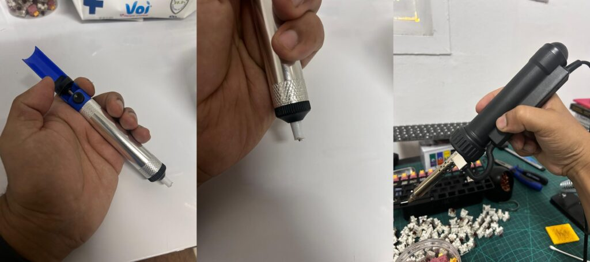
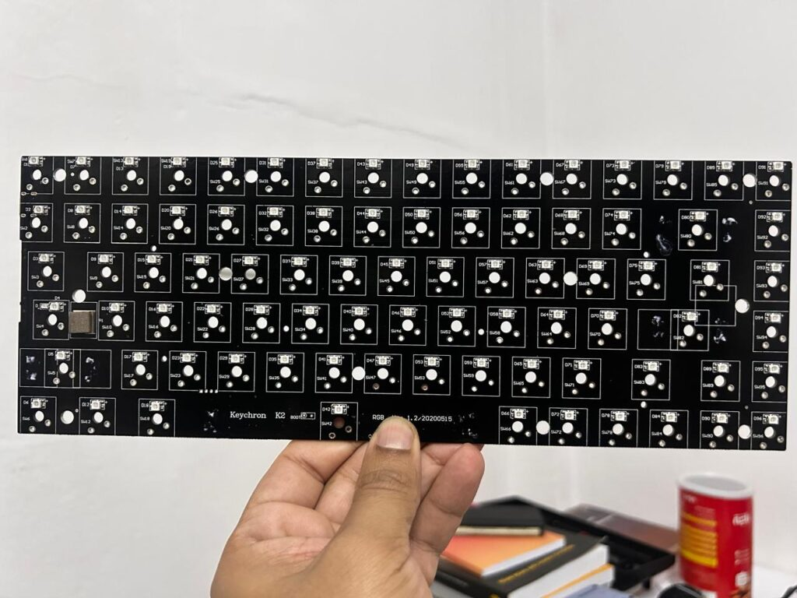
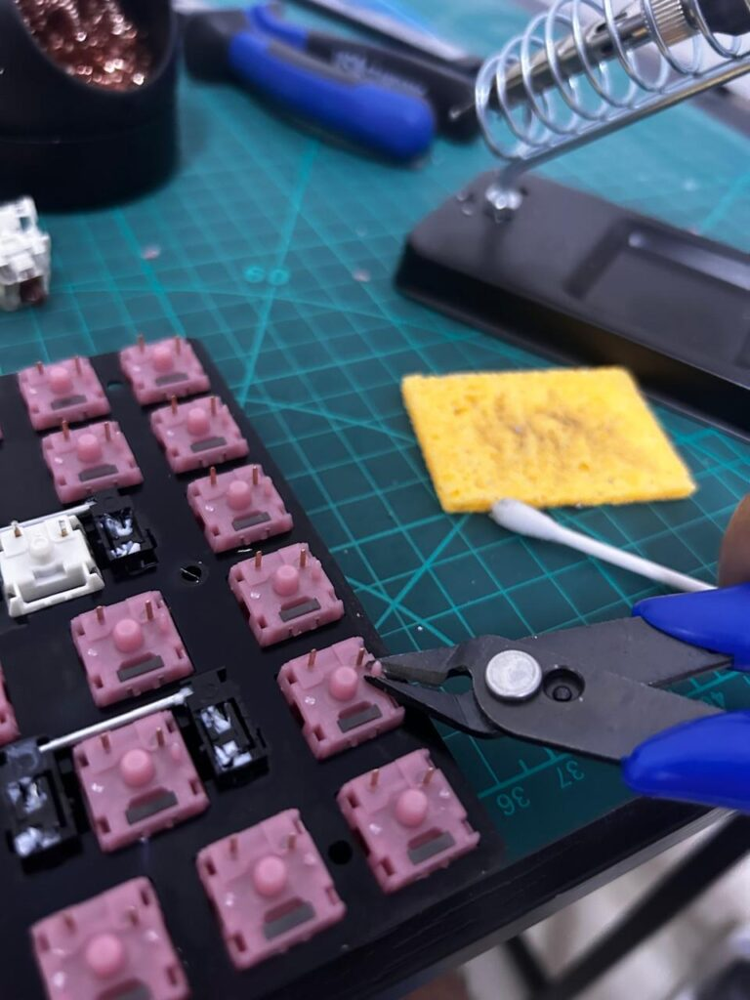
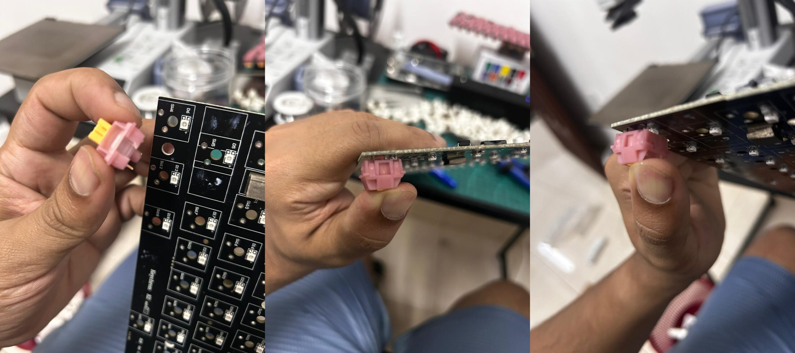
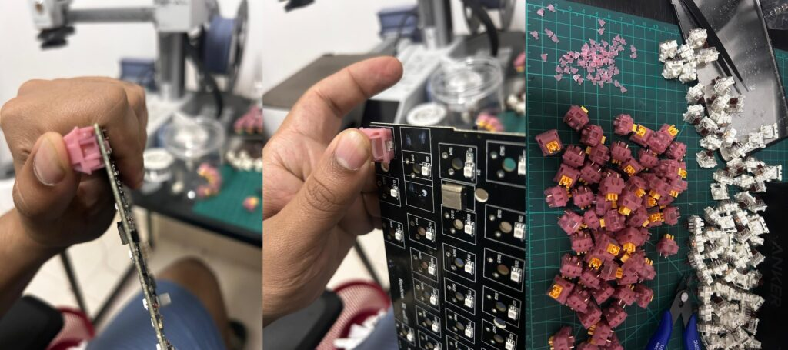
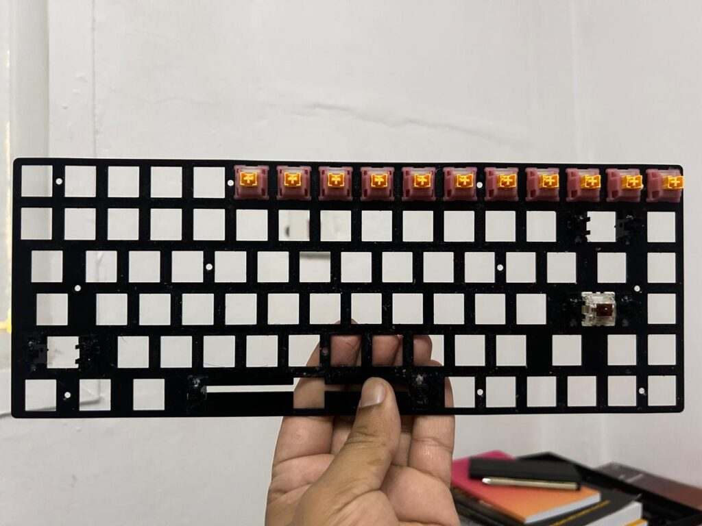
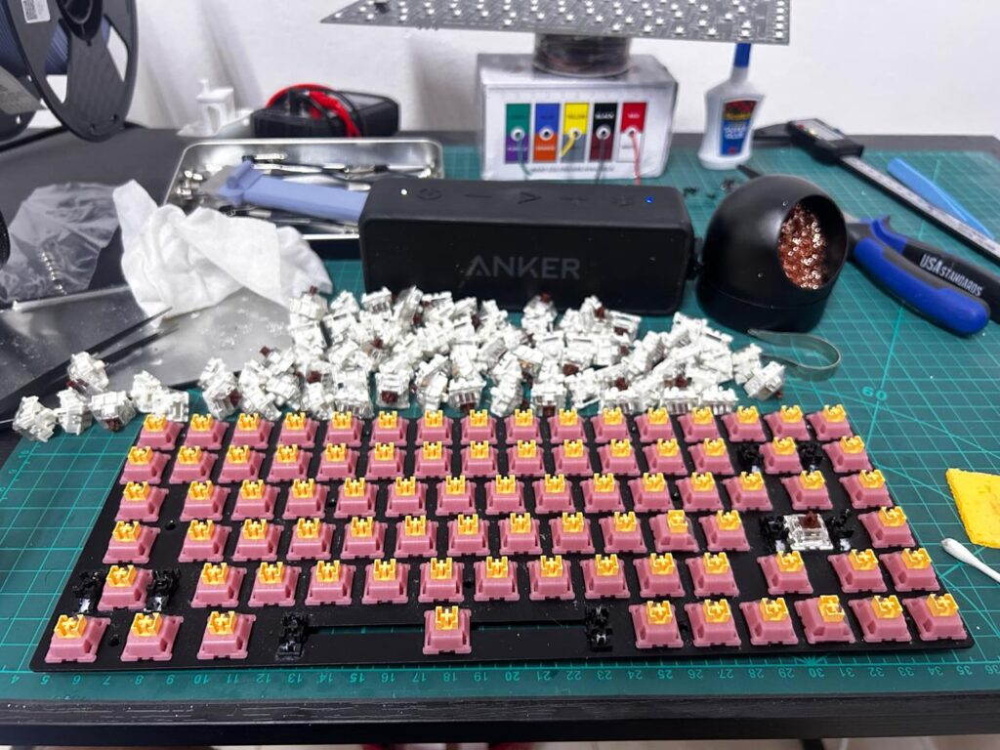
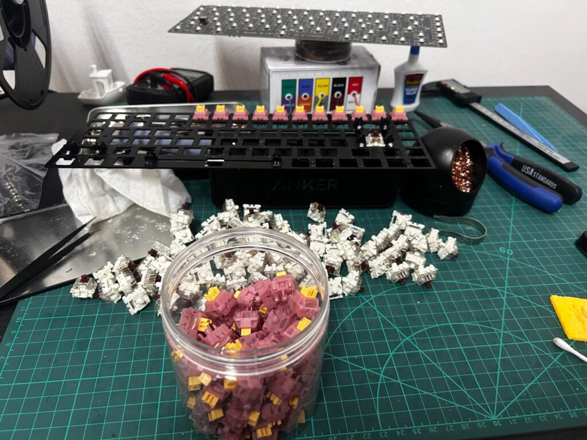
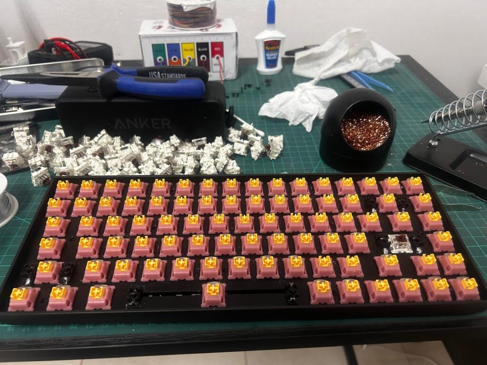

Hey everyone! If you're a mechanical keyboard enthusiast like me, you know the siren song of customization. My trusty Keychron K2v2 has been a fantastic workhorse, but I was craving a change – specifically, a typing experience that was significantly quieter, ensuring I wouldn't bother those around me – particularly my wife. Enter the **Outemu Silent Peach V3 switches**!

I decided to take the plunge and swap out all the existing switches. This meant a full desoldering and soldering job, as K2V2 was not a hot-swappable one, but the promise of a transformed keyboard was too tempting to resist. Here's a look at how the process went, including some important lessons about tooling!

**The Goal:** Replace the Cherry MX brown on my Keychron K2v2 with Outemu Silent Peach switches for a quieter, smoother typing experience, with a few necessary modifications along the way!

##### **The Tools & Materials:**

- Keychron K2v2 Keyboard
- A big batch of Outemu Silent Peach switches (enough for the whole board, plus a few spares!)
- Soldering Iron
- **A Quality Desoldering Pump:** This is CRUCIAL. Initially, I tried a very cheap, basic desoldering pump (like the blue and silver one shown below). However, its ABS plastic tip started to melt after desoldering just 7-8 switches, and it quickly lost suction. This was a major roadblock! I highly recommend investing in a more robust desoldering pump, like the black one I ultimately used, or one with a flexible, heat-resistant silicone tip (e.g., from brands like Engineer). The difference in performance and durability is night and day.

- Solder
- Keycap Puller (not pictured, but essential for step 1!)
- Switch Puller (can be helpful even for soldered boards once desoldered)
- Screwdrivers (for opening the keyboard case)
- Tweezers
- Flush cutters (absolutely essential for switch modification in this case!)
- Work mat (like my green cutting mat)
- Patience and a bit of ingenuity!

##### **The Process: Step-by-Step**

###### 1. **Disassembly & Prep:**

First, I removed all the keycaps. Then, I carefully opened up the Keychron K2v2 case to get access to the PCB and plate assembly.

###### 2. **The Great Desolder (Choose Your Weapon Wisely!):**

This was the most time-consuming part, and where good tooling really matters. As mentioned above, my initial attempt with a cheap desoldering pump was frustrating. Once I switched to my more reliable pump, the process became much smoother. I meticulously heated each solder joint for every switch pin and sucked away the molten solder. The goal is to clear the holes on the PCB completely so the old switches can be removed. Behold the beautifully bare Keychron K2 PCB after all the old switches were desoldered and removed. What a sight!

###### **3. Populating the Plate (and Essential Switch Modifications):**

###### **3.a. 5-pin to 3-pin Conversion** 

My Outemu Silent Peach switches were 5-pin (two metal pins, a large central plastic post, and two smaller plastic guide pins/tabs). However, the Keychron K2v2's PCB is designed for 3-pin switches. So, using my flush cutters again, I carefully clipped off the two smaller plastic guide pins from the bottom of each switch.

###### **3.b. Addressing Light Guide Interference**

I noticed that the built-in light guide on the Outemu Silent Peach switches (the clear plastic part designed to diffuse LED light) was sitting proud and hitting the surface-mounted LEDs on the Keychron K2v2's PCB. This prevented the switches from sitting completely flush. To fix this, I carefully used my flush cutters to trim some of the plastic on the switch housing *around* the light guide. This allowed the light guide to recess slightly or be pushed a little further into the switch body, providing the necessary clearance for the switch to sit perfectly flush against the PCB. This is a crucial step for ensuring proper fit and feel. You can see how the switch should ideally sit in the pics below. You can see some of these clipped-off pink plastic pieces too.

With these modifications done, the switches were ready! I started by placing them into the keyboard's top plate. This helps align them correctly before they are inserted into the PCB. With the initial few switches going in, we have began our journey...

Now the plate is filled up with those lovely (and now perfectly compatible!) pink and yellow switches.

You can also see my stash of Silent Peaches and the removed old switches.

###### **4. Aligning with the PCB:**

Once the switches were in the plate (and properly modified), I carefully aligned the plate assembly with the PCB. It's crucial to ensure that all the switch pins (the two metal legs and the larger plastic central post) go through their respective holes in the PCB without bending, and that the switches are sitting flush.

###### **5. Soldering the New Switches:**

With all switches perfectly seated and their pins poking through the PCB, it was time to make the connections permanent. I carefully soldered each pin, aiming for clean, shiny joints. This secures the switches and ensures a good electrical connection.

###### **6. Testing & Reassembly:**

Before closing everything up, I plugged in the PCB and tested every single key using an online keyboard tester. This is a VITAL step – you don't want to reassemble everything only to find a dead key! Once confirmed all keys were working, I carefully put the keyboard back into its case, screwed it shut, and reinstalled the keycaps.

##### **The Result? Pure Bliss!**

The transformation is incredible! The Outemu Silent Peach switches are significantly quieter than the stock ones, making for a much more office-friendly (and late-night-friendly) typing experience. They have a smooth linear feel, and the silencing is very effective without feeling mushy.

I even left the original Enter key switch untouched – a small, clicky homage that provides a pleasing contrast and a constant reminder of just how quiet and smooth the new setup is.

This project took a bit of time and patience, especially the desoldering (invest in a good pump!) and the necessary switch modifications to ensure a perfect fit. But seeing (and hearing!) the final result makes it all worthwhile. My Keychron K2v2 now feels like a brand-new, premium keyboard, tailored exactly to my preferences.

##### **Would I recommend it?**

Absolutely! If you're comfortable with a soldering iron and looking to customize your keyboard's feel and sound, swapping switches is a deeply satisfying mod. Just take your time, be patient, **invest in decent tools (especially a desoldering pump!)**, carefully check for switch/PCB compatibility (and be ready with flush cutters for any necessary adjustments!), and enjoy the process of making your keyboard truly your own.

Happy modding!
