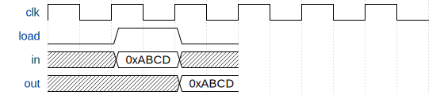

*This is Part 1 of the KiKi-Pi-One series, where we build a 16-bit CPU from scratch.*
*[<- Part 0: The ISA](/posts/kiki-pi-one-part-0-isa/) | [GitHub](https://github.com/SreejitS/KiKi-Pi-One) | [Live Demo](https://kiki-pi-one.vercel.app/registers)*

Every CPU needs memory. Not the gigabytes-of-RAM kind. The tiny, fast storage sitting right inside the processor. The kind that holds a single value and can update it in one clock cycle. That is a **register**. In KiKi-Pi-One, the CPU has two registers - **A** and **D** - and they are both instances of the same simple module we are building today.

## The Interface

A register is a **D flip-flop** scaled to 16 bits. A D flip-flop is a memory element with a simple contract: on every rising clock edge, if the load signal is 1, capture the input. Otherwise, keep the current value.

```
     +-------------------------+
  in |16                       | 16
---->|         register        |----> out
     |                         |
load |                         |
---->|                         |
     |                         |
 clk |                         |
---->|                         |
     +-------------------------+
```

| Port  | Width | Direction | Description |
|-------|-------|-----------|-------------|
| `clk` | 1     | Input     | Clock - rising-edge triggered |
| `load`| 1     | Input     | Write enable - 1 to latch `in`, 0 to hold |
| `in`  | 16    | Input     | Data to store |
| `out` | 16    | Output    | Currently stored value |

## Timing Diagram

The output does not change *when* you set `load = 1`. It changes on the **next rising clock edge**. This edge-triggered behaviour is what makes digital design predictable. All registers in the system update simultaneously on the clock edge, eliminating race conditions.



Cycle by cycle: `load` goes high with `in = 0xABCD`. On the next rising edge, `out` latches to `0xABCD`. When `load` drops back to 0, the register holds that value regardless of what appears on `in`.

## Implementation

Here is the complete SystemVerilog. If you need more than a few lines to implement a register, something is wrong.

```systemverilog
// register.sv
`timescale 1ns/1ps

module register (
    input  logic        clk,
    input  logic        load,
    input  logic [15:0] in,
    output logic [15:0] out
);
    always_ff @(posedge clk) begin
        if (load)
            out <= in;
    end

    initial out = 16'h0000;
endmodule
```

### Breaking it down

**`logic [15:0]`** - SystemVerilog's `logic` type replaces Verilog's `wire`/`reg` distinction. `[15:0]` means 16 bits, indexed from 15 (most significant bit) down to 0 (least significant bit).

**`always_ff @(posedge clk)`** - This is the key construct. `always_ff` explicitly models a flip-flop (sequential logic). The `@(posedge clk)` means "trigger on the rising clock edge". Synthesis tools use this to infer actual flip-flop primitives on an FPGA or ASIC.

**`if (load) out <= in`** - The non-blocking assignment `<=` (as opposed to blocking `=`) is critical in sequential blocks. All non-blocking assignments evaluate their right-hand sides *first*, then update their targets simultaneously. This is how hardware actually works: all flip-flops on the chip update at the same instant on the clock edge.

**`initial out = 16'h0000`** - Sets the simulation starting value to 0. In real hardware, flip-flops power up to an undefined state, but for simulation this gives us a clean baseline.

### What about reset?

There is no reset signal here. For simulation, `initial` handles the starting state. If targeting an FPGA, we would add a synchronous reset:

```systemverilog
always_ff @(posedge clk) begin
    if (reset)     out <= 16'h0000;
    else if (load) out <= in;
end
```

We add this when we integrate into the full CPU. For now, keep it simple.

## Test

The testbench proves the register works by testing every edge case: hold on load=0, latch on load=1, overwrite, and hold across multiple clock ticks.

```systemverilog
`timescale 1ns/1ps

module tb_register;

    logic        clk;
    logic        load;
    logic [15:0] in;
    logic [15:0] out;

    register dut (.clk(clk), .load(load), .in(in), .out(out));

    initial clk = 0;
    always #5 clk = ~clk;

    task tick;
        input [15:0] expected;
        input [63:0] test_num;
        input [127:0] description;
        begin
            @(posedge clk);
            #1;
            if (out === expected)
                $display("[PASS] Test %0d: %s -> out=0x%04X", test_num, description, out);
            else begin
                $display("[FAIL] Test %0d: %s -> expected=0x%04X, got=0x%04X",
                         test_num, description, expected, out);
                $finish(1);
            end
        end
    endtask

    integer pass_count;

    initial begin
        pass_count = 0;
        load = 0;
        in   = 16'h0000;

        // Test 1: load=0 holds initial value
        load = 0; in = 16'hDEAD;
        tick(16'h0000, 1, "load=0: holds initial 0x0000");
        pass_count++;

        // Test 2: load=1 latches
        load = 1; in = 16'hABCD;
        tick(16'hABCD, 2, "load=1: latches 0xABCD");
        pass_count++;

        // Test 3: load=0 holds latched value
        load = 0; in = 16'hFFFF;
        tick(16'hABCD, 3, "load=0: holds 0xABCD");
        pass_count++;

        // Test 4: load=1 overwrites
        load = 1; in = 16'h1234;
        tick(16'h1234, 4, "load=1: latches 0x1234");
        pass_count++;

        // Test 5: consecutive load
        load = 1; in = 16'h5678;
        tick(16'h5678, 5, "load=1: overwrites to 0x5678");
        pass_count++;

        // Test 6: hold across multiple ticks
        load = 0; in = 16'hBEEF;
        @(posedge clk); #1;
        @(posedge clk); #1;
        @(posedge clk); #1;
        if (out === 16'h5678)
            $display("[PASS] Test 6: load=0: holds 0x5678 across 3 ticks");
        else begin
            $display("[FAIL] Test 6: expected 0x5678, got 0x%04X", out);
            $finish(1);
        end
        pass_count++;

        $display("All %0d tests passed.", pass_count);
        $finish;
    end

    initial begin
        #1000;
        $display("[ERROR] Simulation timeout");
        $finish(1);
    end

endmodule
```

### Running it

```bash
iverilog -g2012 -o tb_register 01-registers/tb/tb_register.sv 01-registers/rtl/register.sv && vvp tb_register
```

Expected output:

```
[PASS] Test 1: load=0: holds initial 0x0000 -> out=0x0000
[PASS] Test 2: load=1: latches 0xABCD -> out=0xABCD
[PASS] Test 3: load=0: holds 0xABCD -> out=0xABCD
[PASS] Test 4: load=1: latches 0x1234 -> out=0x1234
[PASS] Test 5: load=1: overwrites to 0x5678 -> out=0x5678
[PASS] Test 6: load=0: holds 0x5678 across 3 ticks
All 6 tests passed.
```

## Interactive Demo

**-> [Open the Register Demo](https://kiki-pi-one.vercel.app/registers)**

The demo runs the same logic as the SystemVerilog, written in TypeScript so it runs in your browser:

```typescript
// register.ts - mirrors register.sv exactly
export function tickRegister(state: RegisterState, inputs: RegisterInputs): RegisterState {
  const newOut = inputs.load ? inputs.in & 0xFFFF : state.out;
  return { out: newOut };
}
```

Same interface, same behaviour. One compiles to hardware; one runs in Chrome.

## Where This Is Used

In the final CPU, we instantiate two registers:

```systemverilog
// Inside cpu.sv (Part 5)
register reg_A (.clk(clk), .load(load_A), .in(a_input), .out(A));
register reg_D (.clk(clk), .load(load_D), .in(alu_out),  .out(D));
```

- **Register A** holds addresses and constants, feeds into the ALU as operand Y, and doubles as the jump target for the PC
- **Register D** is the general data register and the primary ALU operand X

The `load` signal for each register is decoded from the instruction's destination bits - the `ddd` field we defined in the ISA spec.

## What's Next

We have storage. Now we need computation.

In **Part 2**, we build the **ALU (Arithmetic Logic Unit)** - the component that does all the actual math. We will see how 6 control bits select between 28 different operations, and work through the trick behind the `D+1` operation.

[Part 2: The ALU ->](/posts/kiki-pi-one-part-2-alu/)

---

*[<- Part 0: The ISA](/posts/kiki-pi-one-part-0-isa/)*
*[KiKi-Pi-One on GitHub](https://github.com/SreejitS/KiKi-Pi-One)*
*[Live Demo](https://kiki-pi-one.vercel.app/registers)*
