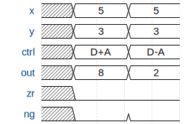

*This is Part 2 of the KiKi-Pi-One series, where we build a 16-bit CPU from scratch.*
*[<- Part 1: The Register](/posts/kiki-pi-one-part-1-registers/) | [GitHub](https://github.com/SreejitS/KiKi-Pi-One) | [Live Demo](https://kiki-pi-one.vercel.app/alu)*

We have storage. Now we need computation. The **ALU (Arithmetic Logic Unit)** is the part of the CPU that does all the math: addition, subtraction, bitwise AND and OR, and logical negation. In KiKi-Pi-One, there is exactly one ALU, and every computation in every program passes through it. A single ALU with just **6 control bits** produces **28 distinct operations**. That sounds like too much, until you understand the trick.

## The Interface

Unlike the register from Part 1, the ALU has no clock. It is purely **combinational** - a term meaning the output updates immediately whenever any input changes. No rising edge, no waiting.

```
     +-------------------------+
  x  |16                       | 16
---->|                         |----> out
     |                         |
  y  |16         ALU           |----> zr
---->|                         |
     |                         |----> ng
     +------------+------------+
                  |
           zx nx zy ny f no
```

| Port | Width | Direction | Description |
|------|-------|-----------|-------------|
| `x`  | 16 | Input | First operand (always from D register) |
| `y`  | 16 | Input | Second operand (from A register or RAM[A], selected by the CPU) |
| `zx` |  1 | Input | Zero x - replace x with 0 |
| `nx` |  1 | Input | Bitwise NOT x (after zx) |
| `zy` |  1 | Input | Zero y - replace y with 0 |
| `ny` |  1 | Input | Bitwise NOT y (after zy) |
| `f`  |  1 | Input | Function select: 1 = add, 0 = AND |
| `no` |  1 | Input | Bitwise NOT the output |
| `out`| 16 | Output | Result |
| `zr` |  1 | Output | Zero flag: 1 if out == 0 |
| `ng` |  1 | Output | Negative flag: 1 if out < 0 (signed, two's complement) |

The two output flags, `zr` and `ng`, feed directly into the jump logic in the CPU. They let the program test conditions without a separate comparison instruction.

## Timing

The ALU is purely combinational - output changes within the same time step as inputs. No clock edge required.



Change the control bits, and the output updates instantly. No clock needed.

## The Big Insight: 6 Bits, 28 Operations

The control bits apply **successive transformations** in a fixed pipeline:

```
x --[zx]--[nx]--+
                +--[f]--[no]--> out
y --[zy]--[ny]--+
```

Each stage either passes its input unchanged or transforms it:

1. **zx**: replace x with 0 (or keep x)
2. **nx**: bitwise NOT x (or keep x)
3. **zy**: replace y with 0 (or keep y)
4. **ny**: bitwise NOT y (or keep y)
5. **f**: output = x + y (add) or x & y (AND)
6. **no**: bitwise NOT the output (or keep it)

By composing these simple transformations, you synthesise any of the 28 ISA operations:

| Operation | zx | nx | zy | ny | f | no | Result |
|-----------|----|----|----|----|---|----|--------|
| `0`       |  1 |  0 |  1 |  0 | 1 |  0 | Constant 0 |
| `1`       |  1 |  1 |  1 |  1 | 1 |  1 | Constant 1 |
| `-1`      |  1 |  1 |  1 |  0 | 1 |  0 | Constant -1 |
| `D`       |  0 |  0 |  1 |  1 | 0 |  0 | D |
| `A`       |  1 |  1 |  0 |  0 | 0 |  0 | A |
| `!D`      |  0 |  0 |  1 |  1 | 0 |  1 | NOT D |
| `!A`      |  1 |  1 |  0 |  0 | 0 |  1 | NOT A |
| `-D`      |  0 |  0 |  1 |  1 | 1 |  1 | Negate D |
| `-A`      |  1 |  1 |  0 |  0 | 1 |  1 | Negate A |
| `D+1`     |  0 |  1 |  1 |  1 | 1 |  1 | D + 1 |
| `A+1`     |  1 |  1 |  0 |  1 | 1 |  1 | A + 1 |
| `D-1`     |  0 |  0 |  1 |  1 | 1 |  0 | D - 1 |
| `A-1`     |  1 |  1 |  0 |  0 | 1 |  0 | A - 1 |
| `D+A`     |  0 |  0 |  0 |  0 | 1 |  0 | D + A |
| `D-A`     |  0 |  1 |  0 |  0 | 1 |  1 | D - A |
| `A-D`     |  0 |  0 |  0 |  1 | 1 |  1 | A - D |
| `D&A`     |  0 |  0 |  0 |  0 | 0 |  0 | D AND A |
| `D\|A`    |  0 |  1 |  0 |  1 | 0 |  1 | D OR A |

Each row with `A` has a corresponding `M` variant (e.g. `D+M`, `!M`) that uses the same control bits but with `y = RAM[A]` instead of `y = A`. The CPU handles that mux before the ALU, so the ALU itself never sees the `a` bit.

## The D+1 Trick

How does `D+1` work with bits `zx=0, nx=1, zy=1, ny=1, f=1, no=1`? Let us trace through with D = 5.

**Step 1 - zx=0:** x stays as D = 5

**Step 2 - nx=1:** x = ~5 = 0xFFFA (bitwise NOT, all bits flipped)

**Step 3 - zy=1:** y = 0

**Step 4 - ny=1:** y = ~0 = 0xFFFF (in two's complement, this is -1)

**Step 5 - f=1 (add):** result = 0xFFFA + 0xFFFF = 0x1FFF9. 16-bit arithmetic discards the carry, so result = 0xFFF9.

**Step 6 - no=1:** out = ~0xFFF9 = 0x0006 = 6

And 5 + 1 = 6. It works.

The identity at play:

```
~(~D + (-1)) = ~(-D - 1 - 1) = ~(-D - 2) = (D + 2) - 1 = D + 1
```

The six control bits exploit the relationship between bitwise NOT and two's complement arithmetic to produce any of the 28 operations from just an adder and an AND gate plus a few pre/post inversions.

## Implementation

Here is the complete SystemVerilog. Like the register, it fits in a handful of lines.

```systemverilog
// alu.sv
`timescale 1ns/1ps

module alu (
    input  logic [15:0] x,
    input  logic [15:0] y,
    input  logic        zx,
    input  logic        nx,
    input  logic        zy,
    input  logic        ny,
    input  logic        f,
    input  logic        no,
    output logic [15:0] out,
    output logic        zr,
    output logic        ng
);
    logic [15:0] px, py, result;

    always_comb begin
        // Pre-process x
        px = zx ? 16'h0000 : x;
        px = nx ? ~px : px;

        // Pre-process y
        py = zy ? 16'h0000 : y;
        py = ny ? ~py : py;

        // Compute
        result = f ? (px + py) : (px & py);

        // Post-process
        out = no ? ~result : result;

        // Flags
        zr = (out == 16'h0000);
        ng = out[15];
    end

endmodule
```

### Breaking it down

**`always_comb`** tells the synthesis tool this is combinational logic. No clock, no flip-flops. The block re-evaluates whenever any input changes. Compare this to Part 1's `always_ff @(posedge clk)`, which only triggers on clock edges.

**Intermediate signals `px` and `py`** hold the pre-processed versions of x and y. SystemVerilog allows multiple assignments to the same variable inside `always_comb` - each replaces the previous. This is valid for combinational logic.

**`result`** is 16 bits. When two 16-bit values are added and overflow, the carry bit is silently discarded. That is the two's complement wraparound we rely on for subtraction.

**`zr = (out == 16'h0000)`** computes the zero flag. The synthesis tool optimises this into the appropriate gate structure.

**`ng = out[15]`** extracts the sign bit. In two's complement, bit 15 being 1 means the value is negative.

## Test

The testbench covers all 28 ISA operations plus two flag edge cases. Since the ALU is combinational, there is no clock - we set inputs, wait one nanosecond for propagation, and check.

```systemverilog
// Excerpt from tb_alu.sv - all 28 operations tested with x=5, y=3

{zx,nx,zy,ny,f,no} = 6'b101010; check(16'h0000, 1, 0, "0");      // constant 0
{zx,nx,zy,ny,f,no} = 6'b111111; check(16'h0001, 0, 0, "1");      // constant 1
{zx,nx,zy,ny,f,no} = 6'b000010; check(16'h0008, 0, 0, "D+A");    // 5+3=8
{zx,nx,zy,ny,f,no} = 6'b010011; check(16'h0002, 0, 0, "D-A");    // 5-3=2
{zx,nx,zy,ny,f,no} = 6'b000111; check(16'hFFFE, 0, 1, "A-D");    // 3-5=-2
{zx,nx,zy,ny,f,no} = 6'b011111; check(16'h0006, 0, 0, "D+1");    // 5+1=6
{zx,nx,zy,ny,f,no} = 6'b000000; check(16'h0001, 0, 0, "D&A");    // 5&3=1
{zx,nx,zy,ny,f,no} = 6'b010101; check(16'h0007, 0, 0, "D|A");    // 5|3=7
```

### Running it

```bash
iverilog -g2012 -o tb_alu 02-alu/tb/tb_alu.sv 02-alu/rtl/alu.sv && vvp tb_alu
```

Expected output:

```
[PASS] 01: 0      -> 0x0000 (zr=1 ng=0)
[PASS] 02: 1      -> 0x0001 (zr=0 ng=0)
[PASS] 03: -1     -> 0xFFFF (zr=0 ng=1)
[PASS] 04: D      -> 0x0005 (zr=0 ng=0)
[PASS] 05: A      -> 0x0003 (zr=0 ng=0)
[PASS] 06: !D     -> 0xFFFA (zr=0 ng=1)
[PASS] 07: !A     -> 0xFFFC (zr=0 ng=1)
[PASS] 08: -D     -> 0xFFFB (zr=0 ng=1)
[PASS] 09: -A     -> 0xFFFD (zr=0 ng=1)
[PASS] 10: D+1    -> 0x0006 (zr=0 ng=0)
[PASS] 11: A+1    -> 0x0004 (zr=0 ng=0)
[PASS] 12: D-1    -> 0x0004 (zr=0 ng=0)
[PASS] 13: A-1    -> 0x0002 (zr=0 ng=0)
[PASS] 14: D+A    -> 0x0008 (zr=0 ng=0)
[PASS] 15: D-A    -> 0x0002 (zr=0 ng=0)
[PASS] 16: A-D    -> 0xFFFE (zr=0 ng=1)
[PASS] 17: D&A    -> 0x0001 (zr=0 ng=0)
[PASS] 18: D|A    -> 0x0007 (zr=0 ng=0)
[PASS] 19: M      -> 0x0007 (zr=0 ng=0)
[PASS] 20: !M     -> 0xFFF8 (zr=0 ng=1)
[PASS] 21: -M     -> 0xFFF9 (zr=0 ng=1)
[PASS] 22: M+1    -> 0x0008 (zr=0 ng=0)
[PASS] 23: M-1    -> 0x0006 (zr=0 ng=0)
[PASS] 24: D+M    -> 0x000C (zr=0 ng=0)
[PASS] 25: D-M    -> 0xFFFE (zr=0 ng=1)
[PASS] 26: M-D    -> 0x0002 (zr=0 ng=0)
[PASS] 27: D&M    -> 0x0005 (zr=0 ng=0)
[PASS] 28: D|M    -> 0x0007 (zr=0 ng=0)
[PASS] 29: zr     -> 0x0000 (zr=1 ng=0)
[PASS] 30: ng     -> 0x8000 (zr=0 ng=1)
All 30 tests passed.
```

## Interactive Demo

**-> [Open the ALU Demo](https://kiki-pi-one.vercel.app/alu)**

The TypeScript implementation mirrors the SystemVerilog exactly:

```typescript
// alu.ts
export function computeALU(inputs: ALUInputs): ALUOutput {
  let px = inputs.zx ? 0 : inputs.x;
  px = inputs.nx ? (~px & 0xFFFF) : px;
  let py = inputs.zy ? 0 : inputs.y;
  py = inputs.ny ? (~py & 0xFFFF) : py;
  const result = inputs.f ? ((px + py) & 0xFFFF) : (px & py);
  const out    = inputs.no ? (~result & 0xFFFF) : result;
  return {
    out,
    zr: out === 0 ? 1 : 0,
    ng: (out >> 15) & 1 ? 1 : 0,
  };
}
```

Same algorithm, same output. One compiles to silicon; one runs in Chrome.

## Where This Is Used

In the final CPU, the ALU sits at the centre of every computation:

```systemverilog
// Inside cpu.sv (Part 5)
alu alu_unit (
    .x  (D),
    .y  (alu_y),      // mux: A when a=0, M when a=1
    .zx (inst[11]),
    .nx (inst[10]),
    .zy (inst[9]),
    .ny (inst[8]),
    .f  (inst[7]),
    .no (inst[6]),
    .out(alu_out),
    .zr (zr),
    .ng (ng)
);
```

The six `inst` bits come directly from the `cccccc` field of the C-instruction. No decoder needed. The instruction format and the ALU ports are designed to match exactly.

## What's Next

We can compute. But computation is useless without somewhere to store results beyond our two registers.

In **Part 3**, we build **Data Memory**: 16,384 words of read/write RAM with memory-mapped I/O for the screen and keyboard. We will see how a single address space handles both RAM and peripherals - one of the most elegant ideas in computer architecture.

[Part 3: Data Memory ->](/posts/kiki-pi-one-part-3-memory/)

---

*[<- Part 1: The Register](/posts/kiki-pi-one-part-1-registers/)*
*[KiKi-Pi-One on GitHub](https://github.com/SreejitS/KiKi-Pi-One)*
*[Live Demo](https://kiki-pi-one.vercel.app/alu)*
