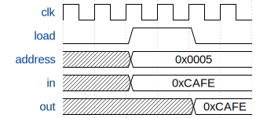

*This is Part 3 of the KiKi-Pi-One series, where we build a 16-bit CPU from scratch.*
*[<- Part 2: The ALU](/posts/kiki-pi-one-part-2-alu/) | [GitHub](https://github.com/SreejitS/KiKi-Pi-One) | [Live Demo](https://kiki-pi-one.vercel.app/memory)*

We have registers that store two values. We have an ALU that can compute anything the ISA defines. But two registers are not enough. A loop needs a counter variable. A function call needs a stack. A game needs a screen. **Data memory** gives the CPU somewhere to put things - 16,384 words of general-purpose RAM, a screen buffer, and a keyboard register, all sharing a single address bus. The screen and keyboard are not separate "peripherals" with special wiring. They are just addresses. Write to 0x4000 and pixels appear. Read 0x6000 and you get the last key pressed. This is **memory-mapped I/O**, one of the most elegant ideas in computer architecture.

## The Interface

Like the register from Part 1, the memory is **synchronous**: writes happen on the rising clock edge when `load = 1`. Unlike the register, the output is **combinational**: it reflects the value at the current address immediately, without waiting for a clock edge.

```
                  +--------------------------------------+
  address[15] --->|                                      |
                  |                                      |
  in[16]     ---->|           DATA MEMORY                |----> out[16]
                  |                                      |
  load       ---->|  +----------+-----------+----------+ |
  clk        ---->|  |  RAM     |  Screen   | Keyboard | |
                  |  |  16K     |  8K       | 1 word   | |
                  |  |0000-3FFF |4000-5FFF  |  6000    | |
                  |  +----------+-----------+----------+ |
                  +--------------------------------------+
```

| Port      | Width | Direction | Description |
|-----------|-------|-----------|-------------|
| `clk`     | 1     | Input     | Clock - rising-edge triggered |
| `load`    | 1     | Input     | Write enable - 1 to write on next clock edge |
| `address` | 15    | Input     | Memory address (0x0000 to 0x7FFF) |
| `in`      | 16    | Input     | Data to write |
| `out`     | 16    | Output    | Data at current address (combinational read) |

The address is 15 bits wide, covering 32,768 locations. The ISA defines three regions within this space.

## Timing Diagram



Write `0xCAFE` to RAM address `0x0005` with `load = 1`. On the rising edge, the value is latched. The output immediately reflects the stored value at the current address.

## The Memory Map

```
Address Range      Region       Size         Description
-----------------------------------------------------------
0x0000 - 0x3FFF    RAM          16,384 w     General-purpose read/write
0x4000 - 0x5FFF    Screen       8,192 w      Each bit = one pixel (256x512)
0x6000             Keyboard     1 w          ASCII code of last key pressed
```

A C-instruction like `M=D` writes the D register to `RAM[A]`. The A register holds the address. If A = 5, the write goes to general-purpose RAM. If A = 16384 (0x4000), the write goes to the screen buffer. Same instruction, same wire, different destination. The CPU does not need separate "write to RAM" and "write to screen" instructions. It just writes to M. The memory hardware figures out where the data goes based on the address.

## Address Decoding: Two Bits, Three Devices

How does the hardware know which device to talk to? It looks at two bits of the address.

```
address[14]  address[13]  Region
---------------------------------
    0            x         RAM        (0x0000-0x3FFF)
    1            0         Screen     (0x4000-0x5FFF)
    1            1         Keyboard   (0x6000)
```

Let us trace a few addresses to verify:

**Address 0x0005** = `0b000_0000_0000_0101`. Bit [14] = 0 -> RAM. Index = 5.

**Address 0x3FFF** = `0b011_1111_1111_1111`. Bit [14] = 0 -> RAM. Index = 16383 (last RAM word).

**Address 0x4000** = `0b100_0000_0000_0000`. Bit [14] = 1, bit [13] = 0 -> Screen. Index = 0 (first screen word).

**Address 0x6000** = `0b110_0000_0000_0000`. Bit [14] = 1, bit [13] = 1 -> Keyboard.

The decoding is just two wires. No comparators, no lookup tables. The address space was designed so that two bits cleanly partition it.

## The Screen Buffer

Each of the 8,192 screen words holds 16 bits. Each bit controls one pixel: 1 = black (on), 0 = white (off). That gives us 8,192 x 16 = 131,072 pixels, arranged as a 256-row x 512-column display.

To light up the top-left pixel, write `0x0001` to address `0x4000`. The screen buffer is just RAM with a side effect: a display controller reads it continuously and drives the pixels.

## The Keyboard Register

Address `0x6000` holds the ASCII code of the currently pressed key. If no key is pressed, it reads `0x0000`. The CPU can poll it:

```asm
@KBD     // A = 0x6000
D=M      // D = key code (or 0 if no key)
```

The keyboard register is **read-only**. If the CPU tries to write to it, the hardware silently ignores the write.

## Implementation

Here is the complete SystemVerilog. The structure mirrors the three-region memory map exactly.

```systemverilog
// memory.sv
`timescale 1ns/1ps

module memory (
    input  logic        clk,
    input  logic        load,
    input  logic [14:0] address,
    input  logic [15:0] in,
    output logic [15:0] out
);

    // Sub-memories
    logic [15:0] ram    [0:16383];   // 16K words
    logic [15:0] screen [0:8191];    // 8K words
    logic [15:0] kbd;                // 1 word (externally driven)

    // Address decoding
    wire ram_sel    = ~address[14];
    wire screen_sel =  address[14] & ~address[13];
    wire kbd_sel    =  address[14] &  address[13];

    // Synchronous write
    always_ff @(posedge clk) begin
        if (load) begin
            if (ram_sel)
                ram[address[13:0]] <= in;
            else if (screen_sel)
                screen[address[12:0]] <= in;
            // Keyboard is read-only
        end
    end

    // Combinational read
    always_comb begin
        if (ram_sel)
            out = ram[address[13:0]];
        else if (screen_sel)
            out = screen[address[12:0]];
        else if (kbd_sel)
            out = kbd;
        else
            out = 16'h0000;
    end

    initial begin
        for (int i = 0; i < 16384; i++) ram[i] = 16'h0000;
        for (int i = 0; i < 8192;  i++) screen[i] = 16'h0000;
        kbd = 16'h0000;
    end

endmodule
```

### Breaking it down

**Three arrays** model the three regions. `ram` and `screen` are arrays of 16-bit words. `kbd` is a single word, driven externally by the keyboard controller (in the full computer, Part 6).

**Address decoding** uses three `wire` signals derived from the address bits. These are purely combinational - they update instantly when the address changes. `~address[14]` selects the bottom half (RAM). `address[14] & ~address[13]` selects the third quarter (Screen). `address[14] & address[13]` selects the fourth quarter (Keyboard).

**`always_ff @(posedge clk)`** handles writes. On the rising clock edge, if `load = 1`, the decoder checks which region the address falls in and writes to the appropriate array. The keyboard case is missing on purpose - writes to it are silently ignored.

**`always_comb`** handles reads. The output is combinational, meaning it changes immediately when the address changes. This is important: the CPU needs to read `M = RAM[A]` in the same cycle that A is set.

## Test

The testbench covers all three memory regions, boundary addresses, and edge cases.

```systemverilog
// Excerpt from tb_memory.sv

// Write 0xCAFE to RAM address 0x0000
load = 1; address = 15'h0000; in = 16'hCAFE;
check(16'hCAFE, "RAM write/read at 0x0000");

// Last RAM word: 0x3FFF
load = 1; address = 15'h3FFF; in = 16'hBEEF;
check(16'hBEEF, "RAM write/read at 0x3FFF (last RAM word)");

// Screen write at 0x4000
load = 1; address = 15'h4000; in = 16'hF00D;
check(16'hF00D, "Screen write/read at 0x4000");

// Keyboard is read-only
dut.kbd = 16'h0041;  // externally set to ASCII 'A'
load = 1; address = 15'h6000; in = 16'hFFFF;
check(16'h0041, "Keyboard write is ignored (read-only)");
```

### Running it

```bash
iverilog -g2012 -o tb_memory 03-memory/tb/tb_memory.sv 03-memory/rtl/memory.sv && vvp tb_memory
```

Expected output:

```
[PASS] 01: RAM write/read at 0x0000
[PASS] 02: RAM write/read at 0x3FFF (last RAM word)
[PASS] 03: RAM load=0 holds value
[PASS] 04: Screen write/read at 0x4000
[PASS] 05: Screen write/read at 0x5FFF (last screen word)
[PASS] 06: Keyboard read returns external value
[PASS] 07: Keyboard write is ignored (read-only)
[PASS] 08: Multiple RAM writes don't interfere
[PASS] 09: Boundary: RAM 0x3FFF and Screen 0x4000 are separate
[PASS] 10: RAM holds across multiple ticks with load=0
All 10 tests passed.
```

## Interactive Demo

**-> [Open the Memory Demo](https://kiki-pi-one.vercel.app/memory)**

The TypeScript implementation mirrors the SystemVerilog address decoding:

```typescript
// memory.ts
export function tickMemory(state: MemoryState, inputs: MemoryInputs): MemoryState {
  if (!inputs.load) return state;
  const addr = inputs.address & 0x7fff;
  const region = decodeRegion(addr);
  const value = inputs.in & 0xffff;
  if (region === "RAM") {
    const newRam = new Uint16Array(state.ram);
    newRam[addr & 0x3fff] = value;
    return { ...state, ram: newRam };
  }
  if (region === "Screen") {
    const newScreen = new Uint16Array(state.screen);
    newScreen[addr & 0x1fff] = value;
    return { ...state, screen: newScreen };
  }
  return state; // Keyboard is read-only
}
```

Toggle a 15-bit address, see which memory region it falls in, and write values with the familiar LOAD + CLOCK TICK pattern.

## Where This Is Used

In the final CPU, the memory module sits between the ALU output and the M operand:

```systemverilog
// Inside cpu.sv (Part 5)
memory data_memory (
    .clk     (clk),
    .load    (write_M),         // d3 bit of C-instruction
    .address (A[14:0]),         // A register selects address
    .in      (alu_out),         // ALU result is written
    .out     (M)                // M = RAM[A], feeds back into ALU
);
```

When a C-instruction has `d3 = 1` (destination includes M), the ALU output is written to `RAM[A]`. When the ALU needs M as an input (the `a` bit = 1), it reads from this same module. One address bus, one data path, three devices.

## What's Next

We can store values and compute results. But the CPU also needs to know **which instruction to execute next**.

In **Part 4**, we build the **Program Counter** - a register that normally increments by 1 each cycle, but can be loaded with a new value for jumps and resets. It is the simplest component yet, and the last piece before we wire everything together into a CPU.

[Part 4: Program Counter ->](/posts/kiki-pi-one-part-4-pc/)

---

*[<- Part 2: The ALU](/posts/kiki-pi-one-part-2-alu/)*
*[KiKi-Pi-One on GitHub](https://github.com/SreejitS/KiKi-Pi-One)*
*[Live Demo](https://kiki-pi-one.vercel.app/memory)*
