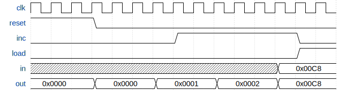

*This is Part 4 of the KiKi-Pi-One series, where we build a 16-bit CPU from scratch.*
*[<- Part 3: Data Memory](/posts/kiki-pi-one-part-3-memory/) | [GitHub](https://github.com/SreejitS/KiKi-Pi-One) | [Live Demo](https://kiki-pi-one.vercel.app/pc)*

We have registers that store values. An ALU that computes. Memory that persists data and maps the screen and keyboard. But none of these parts can do anything useful without answering one question: **which instruction should the CPU execute next?** That is the only job of the **program counter** (PC). It holds a 16-bit address pointing into instruction ROM. Every clock tick, the CPU reads the instruction at that address, executes it, and the PC moves to the next one. Usually "next" means PC + 1. But sometimes the program needs to jump - a loop going back, an if-else branching forward. The PC makes this possible. It is the simplest component we have built so far, but also the most important. Without it, the CPU is a calculator that cannot execute a sequence of instructions.

## The Interface

The PC is a 16-bit register with a priority-encoded mux in front of it. Three control signals tell it what to do on the next clock edge.

```
             +-------------------------------+
  in[16] --->|                               |
             |      PROGRAM COUNTER          |----> out[16]
  load   --->|                               |
  inc    --->|   reset > load > inc > hold   |
  reset  --->|                               |
  clk    --->|                               |
             +-------------------------------+
```

| Port    | Width | Direction | Description |
|---------|-------|-----------|-------------|
| `clk`   | 1     | Input     | Clock - rising-edge triggered |
| `in`    | 16    | Input     | Jump target address (from the A register in the CPU) |
| `load`  | 1     | Input     | Jump enable - 1 to load `in` into the PC |
| `inc`   | 1     | Input     | Increment - 1 to advance to the next instruction |
| `reset` | 1     | Input     | Synchronous reset - 1 to set PC back to 0 |
| `out`   | 16    | Output    | Current PC value - this is the address the CPU fetches from |

## Timing Diagram

Here is what a typical sequence looks like. The CPU starts in reset, then counts through a few instructions, then jumps.



Cycle by cycle:
1. **Reset active** - PC goes to 0. Everything else is ignored.
2. **No signals** - PC holds at 0 (stall).
3. **Inc** - PC advances to 1.
4. **Inc** - PC advances to 2.
5. **Load** - PC jumps to 0x00C8 (200 in decimal).

## Priority: Who Wins?

What happens if `reset` and `load` are both 1 at the same time? The PC uses **priority encoding** - a term meaning the highest-priority signal wins, and the rest are ignored.

```
reset  load  inc  | What happens
-----------------+----------------------------
  1      x    x   | PC = 0          (restart)
  0      1    x   | PC = in         (jump)
  0      0    1   | PC = PC + 1     (next instruction)
  0      0    0   | PC holds        (stall)
```

The `x` means "don't care" - when reset is active, it does not matter what load or inc say.

This priority order makes hardware sense:
- **Reset is king.** When you power on or restart, the CPU must start from address 0 regardless of what any other signal says.
- **Load beats inc.** A jump is an explicit instruction. If the program says "go to address 100", it would be wrong to increment to 101 instead.
- **Inc is the default.** In normal execution, every instruction advances to the next one.

## Implementation

The SystemVerilog is short. A single `always_ff` block with an if/else-if chain that directly implements the priority table.

```systemverilog
// pc.sv
`timescale 1ns/1ps

module pc (
    input  logic        clk,
    input  logic [15:0] in,
    input  logic        load,
    input  logic        inc,
    input  logic        reset,
    output logic [15:0] out
);
    always_ff @(posedge clk) begin
        if (reset)
            out <= 16'h0000;
        else if (load)
            out <= in;
        else if (inc)
            out <= out + 16'h0001;
    end

    initial out = 16'h0000;

endmodule
```

### Breaking it down

**The if/else-if chain** creates the priority. The synthesizer turns this into a priority mux - reset is checked first, then load, then inc. If none match, `out` holds its value. That is SystemVerilog's default for `always_ff` when no branch is taken.

**Overflow wraps naturally.** A 16-bit addition of 0xFFFF + 1 produces 0x0000 with the carry bit discarded. No special handling needed.

**The `initial` statement** sets the simulation starting value. Real hardware would use the reset signal to initialise.

## Test

The testbench covers every row of the priority table plus boundary conditions.

```systemverilog
// Test cases from tb_pc.sv:
// 1. inc: 0 -> 1           (normal advance)
// 2. inc: 1 -> 2           (consecutive increment)
// 3. load: jump to 0x00C8  (explicit jump)
// 4. load beats inc        (priority: load > inc)
// 5. reset beats all       (priority: reset > load > inc)
// 6. hold: no signals      (PC stays put)
// 7. wrap: 0xFFFF -> 0x0000 (overflow)
// 8. reset at zero         (stays at zero)
```

Tests 4 and 5 are the key ones. Test 4 asserts that when both `load` and `inc` are active, the PC takes the jump target, not PC+1. Test 5 asserts that reset overrides everything - even when load and inc are both active, the PC goes to 0.

### Running it

```bash
iverilog -g2012 -o tb_pc 04-pc/tb/tb_pc.sv 04-pc/rtl/pc.sv && vvp tb_pc
```

Expected output:

```
[PASS] Test 1: inc: 0->1
[PASS] Test 2: inc: 1->2
[PASS] Test 3: load: jump to 0x00C8
[PASS] Test 4: load beats inc: jump to 0x0200
[PASS] Test 5: reset beats load+inc: back to 0
[PASS] Test 6: hold: no signals, stays at 0
[PASS] Test 7: wrap: 0xFFFF+1 -> 0x0000
[PASS] Test 8: reset at zero stays zero
All 8 tests passed.
```

## Interactive Demo

**-> [Open the Program Counter Demo](https://kiki-pi-one.vercel.app/pc)**

The TypeScript implementation mirrors the priority logic:

```typescript
// pc.ts
export function tickPC(state: PCState, inputs: PCInputs): PCState {
  if (inputs.reset) {
    return { out: 0 };
  } else if (inputs.load) {
    return { out: inputs.in & 0xffff };
  } else if (inputs.inc) {
    return { out: (state.out + 1) & 0xffff };
  }
  return { out: state.out };
}
```

Toggle the three control switches and click CLOCK TICK to watch the PC count up, jump, or reset.

## Where This Is Used

In the CPU (Part 5), the program counter connects to the instruction ROM and the jump logic:

```
  ROM
  +------+
  |      |---- instruction[16] ----> CPU decode
  |      |
  |      |<--- address[16] ----- PC.out
  +------+
                                      ^
  CPU jump logic --- load ------------+
  CPU clock      --- inc (always 1) --+
  CPU reset      --- reset -----------+
                                      ^
  A register     --- in[16] ----------+
```

The CPU always sets `inc = 1`, so the PC advances every cycle by default. When the CPU decodes a jump instruction and the ALU flags match the jump condition, it asserts `load`, and the PC takes the value from the A register instead of incrementing.

## What's Next

We now have every building block:
- **Registers** to store values (Part 1)
- **ALU** to compute (Part 2)
- **Memory** to read and write data (Part 3)
- **Program Counter** to sequence instructions (this part)

In **Part 5**, we wire them all together into a working CPU. The instruction decoder reads a 16-bit instruction and sets every control signal we have built - register loads, ALU operation, memory write, and the PC's load signal for jumps.

[Part 5: The CPU ->](#)

---

*[<- Part 3: Data Memory](/posts/kiki-pi-one-part-3-memory/)*
*[KiKi-Pi-One on GitHub](https://github.com/SreejitS/KiKi-Pi-One)*
*[Live Demo](https://kiki-pi-one.vercel.app/pc)*
