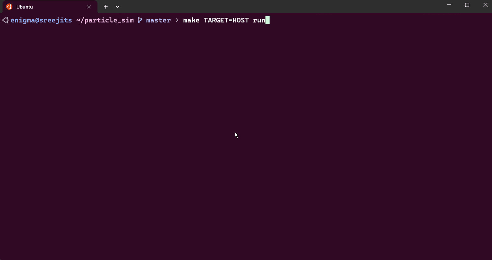

In this project, I combined software simulations, embedded systems, and motion sensing to create an interactive particle simulation that runs on a Raspberry Pi Pico. The particles respond to arrow keys on a host machine and, in a more whimsical twist, tilt gestures detected by an MPU6050 accelerometer when ported to hardware. The result? A tiny interactive gadget in your hands, powered by an RP2040 microcontroller. Let’s dive into how this project came together!

##### **Inspiration**

The seed for this project was planted by [this Embedded Related article](https://www.embeddedrelated.com/showarticle/1695.php), which shows how to simulate your embedded project first on host and then port it to the target you want to finally run. There are multiple reasons why you wanna do something like this. First and foremost, you are waiting for the parts to be decided for the applications by other team engineers or simply waiting for the parts to arrive after ordering them. You may also want to start coding application specific details first and then tackle the low level hardware dependent features later.

Whatever be the reason, I was convinced that this approach leads to better modular architecture for the firmware and the more testable code as there is a clear isolation between the application and the target.

##### **Building the project**

###### **1. Host implementation**

The journey began on a host machine (my laptop). Using [GLFW](https://www.glfw.org/) for rendering, I implemented a basic particle system where:

- Particles are represented as structs with position, velocity, and force attributes.
- Arrow keys apply directional forces (e.g., pressing "up" adds a force pushing particles upward).
- Physics loops calculate acceleration, update velocities, and handle simple boundary collisions.
- Collision logic between the particles made it look "real"

This desktop version became the reference model. The code was written in C, ensuring it could later be ported to the Pico with minimal changes.

###### **2. Porting to Embedded: RP2040, SSD1306 OLED**

Next, I migrated the logic to a Raspberry Pi Pico. Challenges included:

- **Replacing display with the SSD1306 OLED**: The 128x64 monochrome display required pixel-level rendering. I used the `ssd1306` library to draw particles as single pixels or small blobs.
- **Optimizing for Memory**: The RP2040’s 264KB RAM meant trimming floating-point operations. I switched to fixed-point arithmetic for position and velocity calculations.
- **Input Handling**: Instead of arrow keys, I planned to use the MPU6050 IMU. But for testing, I added a constant gravity like force downwards, to simulate the particles falling

###### **3. Integrating the MPU6050 IMU**

The MPU6050 added motion control:

- **I2C Communication**: The IMU communicates with the Pico over I2C. I used the `mpu6050` library to read accelerometer data.
- **Tilt-to-Force Mapping**: Raw accelerometer values were filtered and scaled to generate force vectors. Tilting the device forward, for instance, applies a downward force on particles.
- **Scaling**: Scaling the acceleration values to make it feel more "real" and responsive

###### **4. Bringing It All Together**

The final firmware:

- Initializes the OLED and IMU.
- Runs a physics loop, constrained by the OLED’s refresh rate
- Renders particles while reading accelerometer data to update forces.

##### **Challenges & Learnings**

- **Timing is Everything**: The SSD1306’s slow refresh rate caused flickering. Double buffering (drawing to an offscreen buffer before flushing to the display) helped.
- **Sensor Noise**: The MPU6050’s raw data was noisy. A simple low-pass filter smoothed the accelerometer readings.
- **Memory vs. Performance**: Storing 100 particles with fixed-point math required careful memory management. Reducing the particle count to 50 improved stability.
- **I2C Bus Contention**: The OLED and IMU were decided to be put on different I2C bus to avoid any slowing down due to bus sharing.

##### **The Final Product**

When powered on, the Pico becomes a pocket-sized physics playground:

- Particles float freely, colliding with screen edges.
- Tilting the device pushes the particles in the direction of the tilt.
- A reset button (GPIO) clears and respawns particles.
- The firmware is cleanly separated between app logic and platform-specific sections

The desktop version (with arrow keys) and the embedded version (with motion control) share the same simulation core, proving the flexibility of writing portable C code.

##### **Conclusion**

This project bridges software physics and hardware interaction.

Whether you’re a hobbyist or a seasoned embedded developer, I hope this inspires you to explore the intersection of simulations and hardware. The full code, and build instructions are available on **[GitHub](https://github.com/SreejitS/particle-sim)**. Clone it, tweak the physics constants, or add new sensors—let your particles dance!

##### **Future Ideas**

- Add “attractors” using the Pico’s ADC (e.g., potentiometers to control force fields).
- Port the simulation to an e-paper display for persistent, low-power visuals.
- Create a 3D printed enclosure to give it a more final product vibe.

Let me know what you’d like to see next!
